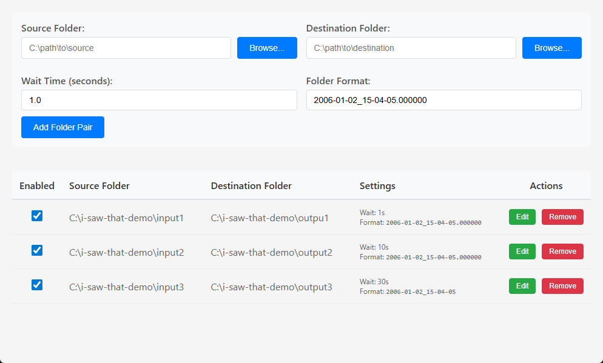

# I Saw That

A simple file and directory watcher and backup utility written in Go.



## Features
- Watches a source directory recursively for changes
- Automatically creates timestamped backups of the source directory to a destination
- Debounces rapid file events to avoid redundant backups
- JSON metadata for backup history
- Extensible observer interface for notifications
- Comprehensive test suite

### Build

- Requires a modified version of fsnotify with recursion enabled that is not included in
this repository.
- Once fsnotify officially supports recursion an official alpha version of the software
  will be released with normal build instructions.

### Run

#### CLI mode

```
./i-saw-that source destination
```

#### GUI mode

Launch the program with no arguments to start it in GUI mode:

```
./i-saw-that
```

## Inspiration
Inspired by [AutoVer](https://www.beanland.net.au/AutoVer/) with the goal of being a
simple alternative that can be ran from the command line.
